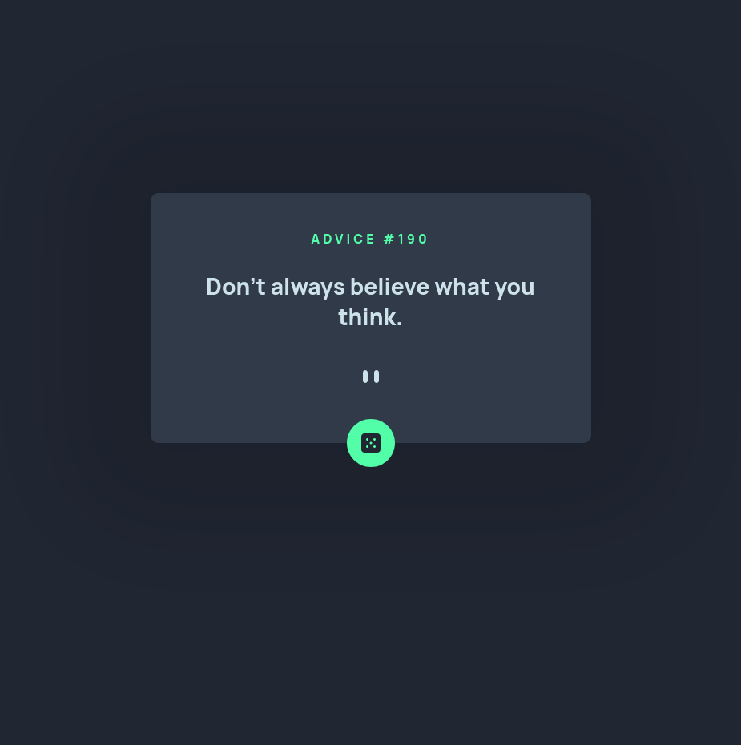

# Frontend Mentor - Advice generator app solution

This is a solution to the [Advice generator app challenge on Frontend Mentor](https://www.frontendmentor.io/challenges/advice-generator-app-QdUG-13db). Frontend Mentor challenges help you improve your coding skills by building realistic projects.

## Table of contents

- [Overview](#overview)
  - [The challenge](#the-challenge)
  - [Screenshot](#screenshot)
  - [Links](#links)
- [My process](#my-process)
  - [Built with](#built-with)
  - [What I learned](#what-i-learned)
- [Author](#author)

## Overview

### The challenge

Users should be able to:

- Randomly fetching advice quotes from Advice Slip.
- Displaying advice and advice number to frontend.

### Screenshot

### Links

- Solution URL: [Frontend Mentor Solution](https://www.frontendmentor.io/challenges/advice-generator-app-QdUG-13db/hub/advice-generator-app-DB4MONzJU)
- Live Site URL: [Live site](https://chris-base.github.io/advice-generator-app/)

## My process

Starting with templete HTML, CSS, and JavaScript files. Creating the layout with an HTML skeleton, and adding styles to the HTML to customize page. Using javascript and using fetch to call API from Advice Slip.

### Built with

- Semantic HTML5 markup
- CSS custom properties
- Flexbox
- CSS Grid
- Mobile-first workflow

### What I learned

I brushed up on making HTTP requests usnig Javascript. I also learned about cache and how that can affect the performance of the website and how the website makes HTTP requests.

## Author

- Website - [Chris Base](https://github.com/chris-base)
- Frontend Mentor - [@chris-base](https://www.frontendmentor.io/profile/chris-base)
